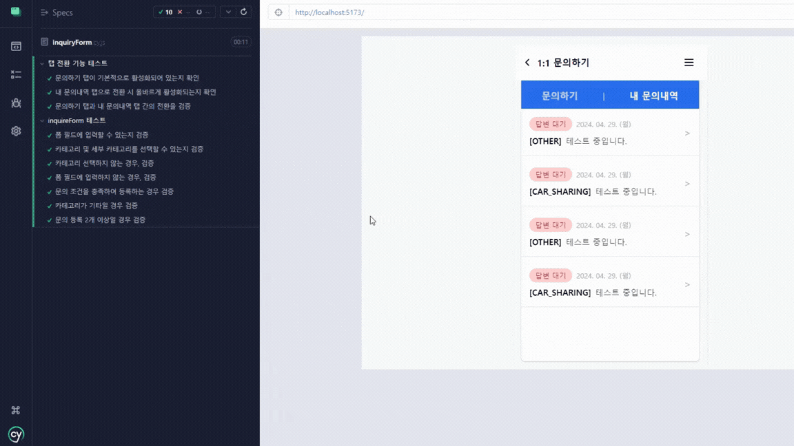

### 문의사항 작성하기 E2E 테스트

**기간:** 2024년 1월

#### 개요

cypress를 직접 적용해보며 E2E 테스트를 만들어보기 위해 만들었습니다.

#### 도전한 기술적 과제

- **e2e 테스트:** cypress를 적용하여 E2E 테스트를 구성하였습니다.
- **msw:** MSW를 통해 직접 API 요청하는 것처럼 테스트를 구현하였습니다.

#### 기술 스택

### 영상

